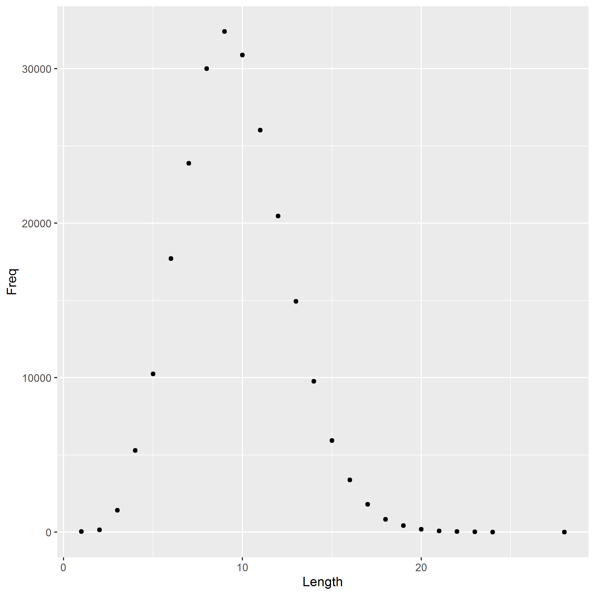

Create the R Markdown file `report.rmd` that:  
* reads the table of word lengths histogram.tsv  
* reports the most common word length  
* displays the pre-made histogram histogram.png  

```{r load-hist-dat, include = FALSE}
dat <- read.delim("histogram.tsv")
```

The downloaded dictionary includes `r sum(dat$Freq)` words.  
The most common word lengths is `r with(dat, Length[which.max(Freq)])`.  

This is the `histogram.png`.  

  
